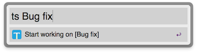
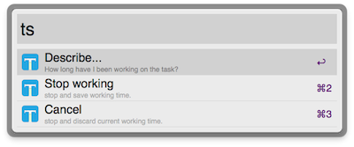

# Timestamp
-----------

Timestamp is an OSX app that aims to record your working time automatically by creating events in the system's Calendar app. It is simple, unobtrusive, and perfectly fit for:

* Freelancer paid by working time.
* Employee who need to record his or her daily and over working time.

## Working Time at a glance

Want to know how long you have been working? Just look up at the menu icon.

From left to right, each icon represents the time have passed since working: 20 minutes, 35 minutes, and 1 hour and 10 minutes.

## Automation

Instead of clicking the menu to start/stop, if you are working in the office or in a coffee shop with fixed WiFi, you can set it as the preferred WiFi from the preferences window. After doing that, Timestamp will automatically start/stop when you connected to / disconnected from the preferred WiFi.

## Alfred Workflow support

Timestamp comes with [Alfred Workflow](http://www.alfredapp.com/) support, so that you can control Timestamp quickly and freely without moving the cursor around. To get the workflow, simply import it from the preferences window.

## FAQ

###### Can I use it with other Calendar?

Yes. Actually OSX's Calendar supports various Calendar Accounts. You can add the one you like from:

Calendar > Preferences… > Accounts > clicking [+].

###### How do I get my working time?

If you are using Google Calendars, then you can use some online tools to report (or event export) your working time. Here is one that I am using: 

[www.gtimereport.com](https://www.gtimereport.com/)

## Requirement

Can only be run in OSX 10.8 (details: it is using the EKEvent APIs, which are only available in OSX 10.8)

# Development 
-------------

Your machine should have these tools installed:

* Ruby 
* Imagemagick (used to convert iconset images)
* Xcode

Run these commands to get the environment prepared:

> git clone https://github.com/shaoshing/timestamp.git

> gem in cocoapods

> cd timestamp

> pod install

> ./Timestamp/Timestamp.iconset/convert.sh

Ok, you are good to go:

> open ./Xcode.xcworkspace

